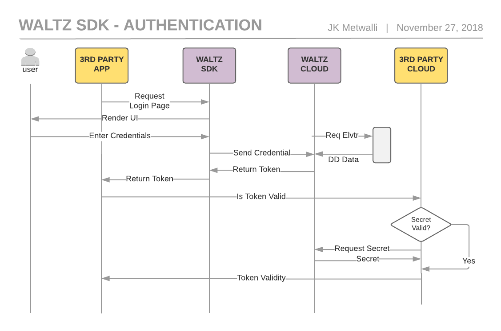
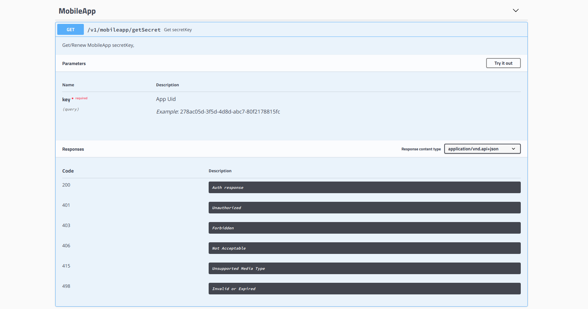
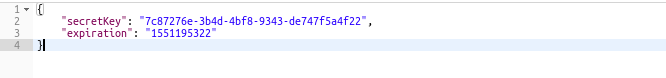

# waltz-SDK-example

git clone https://github.com/WaltzApp/waltz-SDK-example

# OAuth

The OAuth flow is based on this architecture.

  

To have the SDK implementation fetch the JWT, consult the plateform specific documentation under its architecture folder (iOS or Android). For backend validation of the 'secret', please use this endpoint, described below.

GET https://re.waltzlabs.com/mobile/v1/mobileapp/getSecret 

  

This is the expected response: 

  

